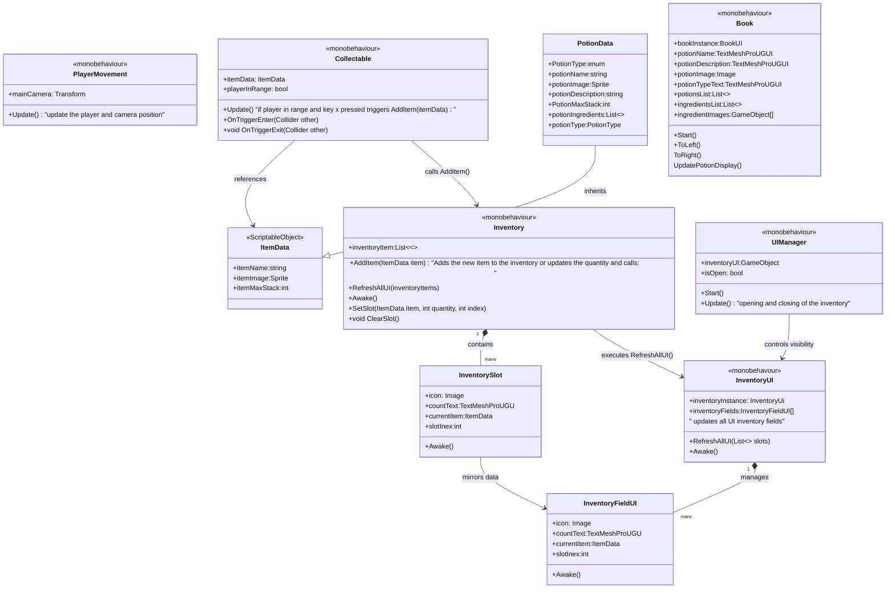

```mermaid
classDiagram
    class PlayerMovement {
        <<monobehaviour>>
        +mainCamera: Transform
        +Update() "update the player and camera position"
        
    }

    class Collectable {
        <<monobehaviour>>
        +itemData: itemData
        +playerInRange: bool
        +Update() "if player in range and key x pressed triggers AddItem(itemData)"
        +OnTriggerEnter(Collider other)
        +void OnTriggerExit(Collider other)
    }

    class ItemData{
        <<ScriptableObject>>
        +itemName:string
        +itemImage:Sprite
        +itemMaxStack:int
    }

    class Inventory {
        <<monobehaviour>>
        +inventoryItem:List<<>
        +AddItem(ItemData item) "Adds the new item to the inventory or updates the quantity and calls: "
        +RefreshAllUI(inventoryItems)
        +Awake()
        +SetSlot(ItemData item, int quantity, int index)
        +void ClearSlot()

    }

     class InventorySlot {
        +icon: Image
        +countText:TextMeshProUGU
        +currentItem:ItemData
        +slotInex:int
        +Awake()
    }


    class InventoryFieldUI {
        +icon: Image
        +countText:TextMeshProUGU
        +currentItem:ItemData
        +slotInex:int
        +Awake()
    }

    class InventoryUI {
        <<monobehavour>>
        +inventoryInstance: InventoryUi
        +inventoryFields:InventoryFieldUI[]
        +RefreshAllUI(List<> slots) 
        " updates all UI inventory fields"
        +Awake()
    }

    class PotionData {
        +PotionType:enum
        +potionName:string
        +potionImage:Sprite
        +potionDescription:string
        +PotionMaxStack:int 
        +potionIngredients:List<>
        +potionType:PotionType
    }

    class Book{
        <<monobehaviour>>
        +bookInstance:BookUI
        +potionName:TextMeshProUGUI
        +potionDescription:TextMeshProUGUI
        +potionImage:Image
        +potionTypeText:TextMeshProUGUI
        +potionsList:List<>
        +ingredientsList:List<>
        +ingredientImages:GameObject[]
        +Start()
        +ToLeft()
        ToRight()
        UpdatePotionDisplay()


    }
    class UIManager {
        <<monobehaviour>>
        +inventoryUI:GameObject
        +isOpen: bool
        +Start()
        +Update() "opening and closing of the inventory"
    }

    %% -------------------------------
    %% RELATIONSHIPS (Edit as needed)
    %% -------------------------------
    Collectable --> ItemData : references
    Collectable --> Inventory : calls AddItem()

    Inventory "1" *-- "many" InventorySlot : contains
    Inventory --> InventoryUI : executes RefreshAllUI()

    InventoryUI "1" *-- "many" InventoryFieldUI : manages
    InventorySlot --> InventoryFieldUI : mirrors data

    PotionData --|> ItemData : inherits

    UIManager --> InventoryUI : controls visibility
```